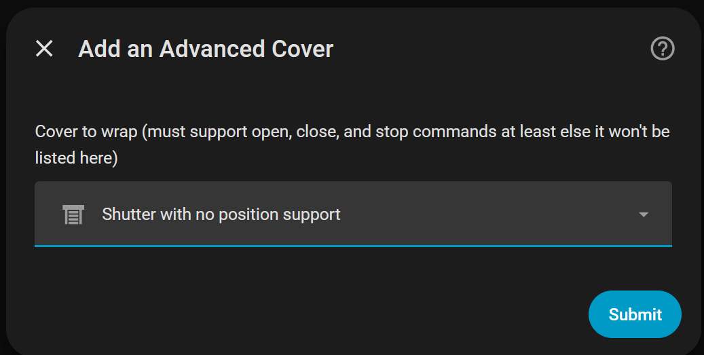
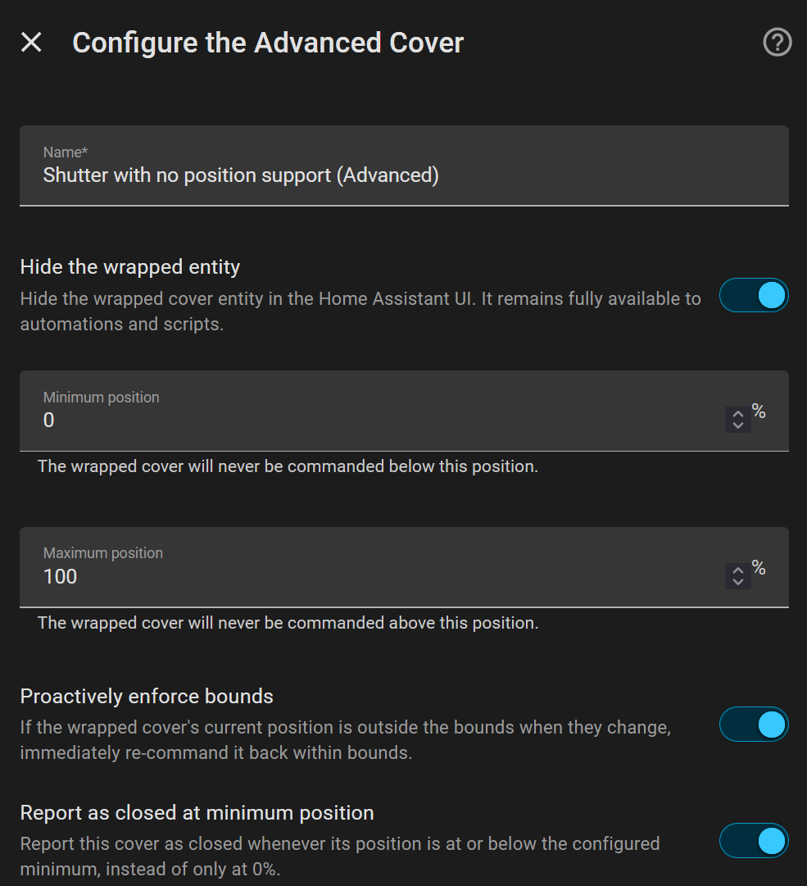
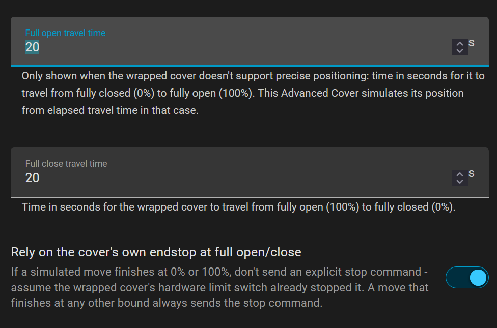

# Advanced Cover

[](https://github.com/hacs/integration)
[](https://www.home-assistant.io/)
[](https://github.com/RomRider/ha-advanced-covers/releases)
[](LICENSE)

A [Home Assistant](https://www.home-assistant.io/) custom integration that wraps an existing `cover` entity
and exposes a new "Advanced Cover" entity whose usable position range is clamped to a configurable
`[min_value, max_value]` window — useful for shades/blinds/awnings where the physical travel range
shouldn't be fully exposed (e.g. a blind that shouldn't ever close all the way, or an awning that
shouldn't fully retract).

It can also simulate a cover’s position for covers that do not natively support setting a position. This is based on the time it takes to go from fully closed to fully opened and fully open to fully closed.

## 🖼️ Configuration options

<p align="center" style="display: flex; align-items: center; justify-content: center;">
  
</p>

<p align="center" style="display: flex; align-items: center; justify-content: center;">
  
  
</p>

<p align="center"><em>Setup flow: add integration → configure bounds + configure optional behavior.</em></p>

## ✨ Features

- 🎯 **Bounded positioning** — every commanded position, and open/close, is clamped to a configurable
  minimum and maximum position before being forwarded to the wrapped cover. The bounds can be updated through actions (`advanced_cover.set_min_position`, `advanced_cover.set_max_position`, see [below](#️-services))
- 🛡️ **Proactive bounds enforcement** (optional) — if the wrapped cover's position ends up outside the
  configured bounds (e.g. from an external command), it's automatically re-commanded back within them.
- ⏱️ **Time-based simulated positioning** — for covers that only support open/close/stop (no native
  position reporting), Advanced Cover estimates an absolute position from configured open/close travel
  times, so you still get a position slider and can command percentages. Activates automatically
  whenever the wrapped cover lacks real positioning support but does support `stop`.
- 🔧 **Runtime-adjustable bounds** — three entity services (`set_min_position`, `set_max_position`,
  `set_enforce_bounds`) let automations change the bounds/enforcement without reloading the integration.
- 🔗 **Device grouping** — each Advanced Cover gets its own device, linked (`via_device`) to the wrapped
  entity's device so the relationship is visible on the device page, and inherits the wrapped entity's
  area by default.
- 🙈 **Optional wrapped-entity hiding** — hide the underlying wrapped cover entity from the UI while
  keeping it fully available to automations and scripts.

## 📦 Installation

### 🛒 HACS (recommended)

This integration isn't in the default HACS store yet, so it needs to be added as a custom repository —
the button below does that automatically:

[](https://my.home-assistant.io/redirect/hacs_repository/?owner=RomRider&repository=ha-advanced-covers&category=integration)

Or manually:

1. In Home Assistant, go to **HACS → Integrations**.
2. Click the three-dot menu (top right) → **Custom repositories**.
3. Add `https://github.com/RomRider/ha-advanced-covers` with category **Integration**.
4. Find **Advanced Cover** in HACS and install it.
5. Restart Home Assistant.

### 🧰 Manual

Copy `custom_components/advanced_cover` into your Home Assistant `config/custom_components/` directory,
then restart Home Assistant.

## ⚙️ Configuration

Configuration is done entirely through the UI:

1. Go to **Settings → Devices & Services → Add Integration**.
2. Search for **Advanced Cover**.
3. Pick the `cover` entity to wrap (it must support open, close, and stop).
4. Configure the name, minimum/maximum position, whether to proactively enforce bounds, whether to hide
   the wrapped entity, and (only shown when the wrapped cover can't report a real position) the open/close
   travel times used for simulated positioning.

> [!TIP]
> All of these settings except the wrapped entity itself can be changed later from the integration's
> **Options** without recreating it.

## 🛎️ Services

All three services target one or more `advanced_cover`-provided `cover.*` entities and persist the change into
the config entry's options (so it survives a restart, and shows up in **Options** too). They apply immediately —
no reload needed.

| Service                             | Description                                          |
| ----------------------------------- | ---------------------------------------------------- |
| `advanced_cover.set_min_position`   | Update the minimum position bound at runtime.        |
| `advanced_cover.set_max_position`   | Update the maximum position bound at runtime.        |
| `advanced_cover.set_enforce_bounds` | Update the proactive-enforcement setting at runtime. |

### `advanced_cover.set_min_position`

Updates the minimum position bound.

| Parameter | Required | Type           | Description                                                                                                                                                                      |
| --------- | -------- | -------------- | -------------------------------------------------------------------------------------------------------------------------------------------------------------------------------- |
| `value`   | Yes      | number (0-100) | The new minimum position.                                                                                                                                                        |
| `enforce` | No       | boolean        | Overrides the entity's configured proactive-enforcement setting for this call only. Omit to use the entity's default, `true` to force an immediate re-clamp, `false` to skip it. |

```yaml
action: advanced_cover.set_min_position
target:
  entity_id: cover.living_room_blind
data:
  value: 10
  enforce: true
```

### `advanced_cover.set_max_position`

Updates the maximum position bound.

| Parameter | Required | Type           | Description                                                                                                                                                                      |
| --------- | -------- | -------------- | -------------------------------------------------------------------------------------------------------------------------------------------------------------------------------- |
| `value`   | Yes      | number (0-100) | The new maximum position.                                                                                                                                                        |
| `enforce` | No       | boolean        | Overrides the entity's configured proactive-enforcement setting for this call only. Omit to use the entity's default, `true` to force an immediate re-clamp, `false` to skip it. |

```yaml
action: advanced_cover.set_max_position
target:
  entity_id: cover.living_room_blind
data:
  value: 90
```

### `advanced_cover.set_enforce_bounds`

Updates the proactive-enforcement setting.

| Parameter | Required | Type    | Description                                                                                  |
| --------- | -------- | ------- | -------------------------------------------------------------------------------------------- |
| `enforce` | Yes      | boolean | Whether the wrapped cover should be proactively re-clamped whenever it's outside the bounds. |

```yaml
action: advanced_cover.set_enforce_bounds
target:
  entity_id: cover.living_room_blind
data:
  enforce: false
```

> [!TIP]
> `target` also accepts `area_id`/`device_id`, and any of these services can be called on multiple Advanced
> Cover entities at once by listing several `entity_id`s.

## 📄 License

[MIT](LICENSE)
